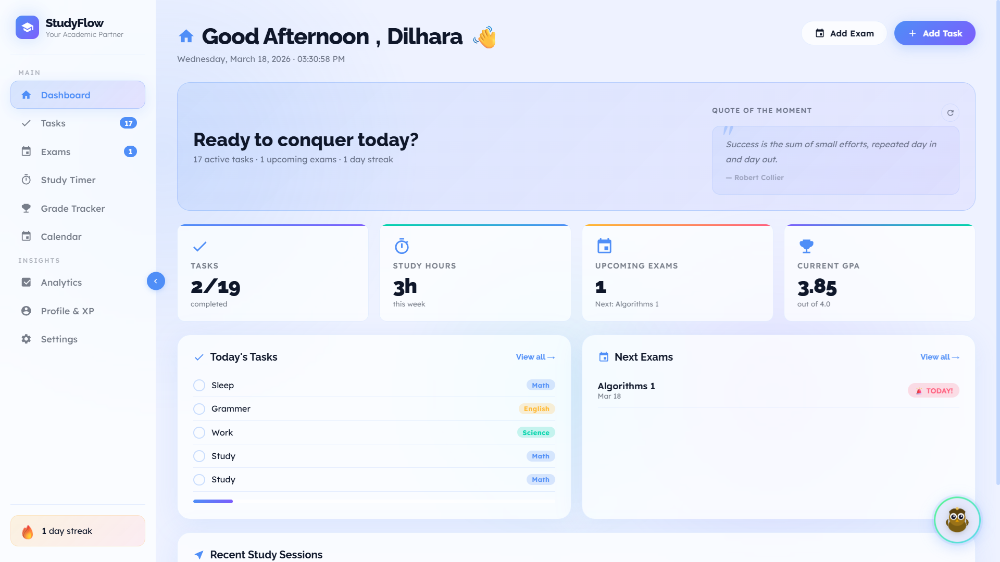
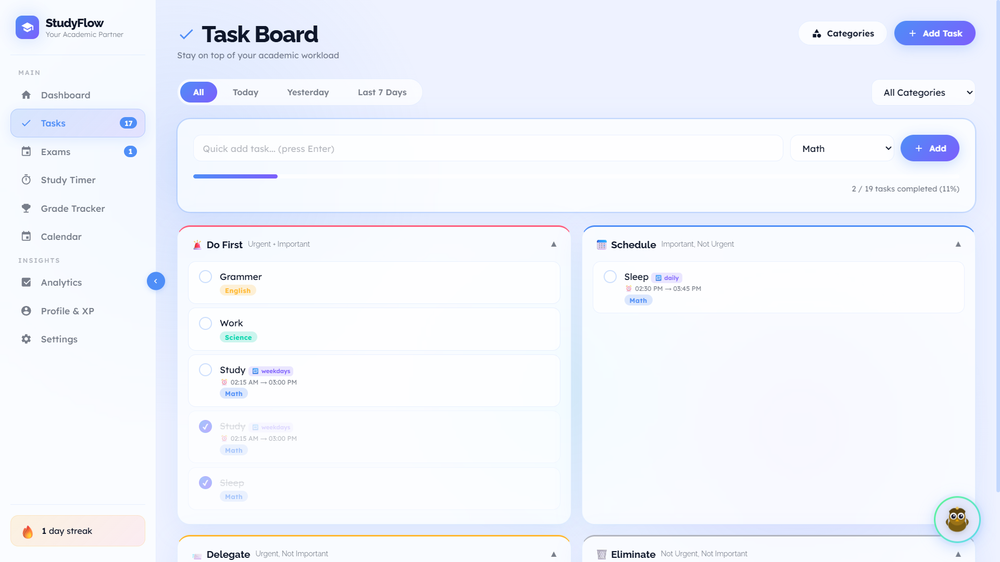
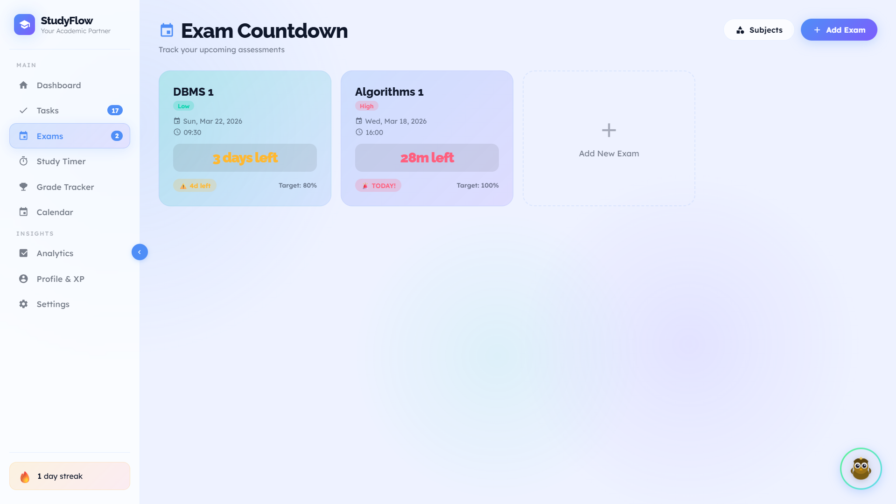
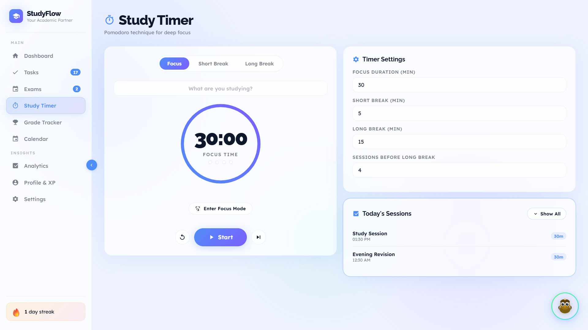
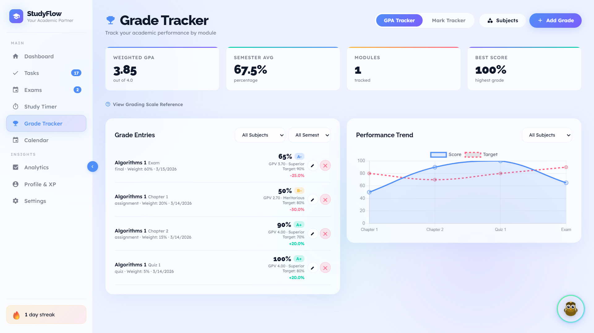
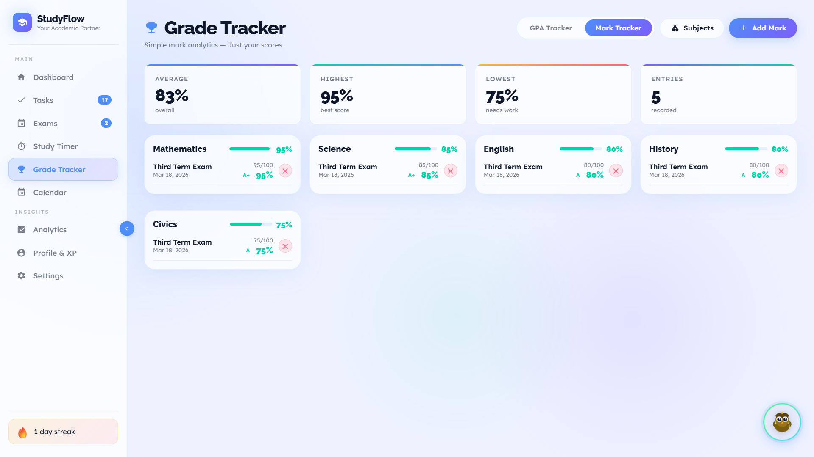
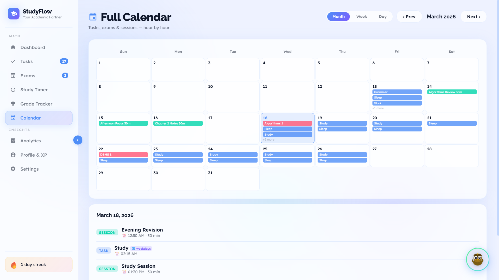
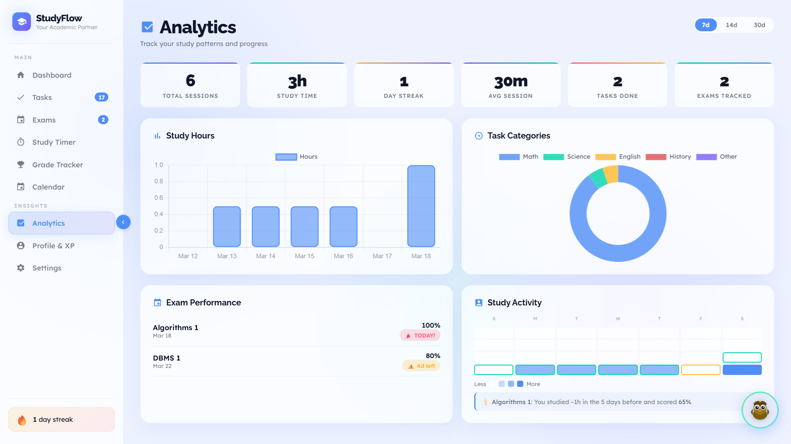
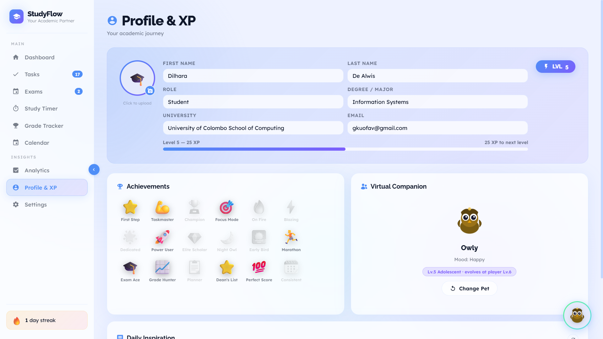
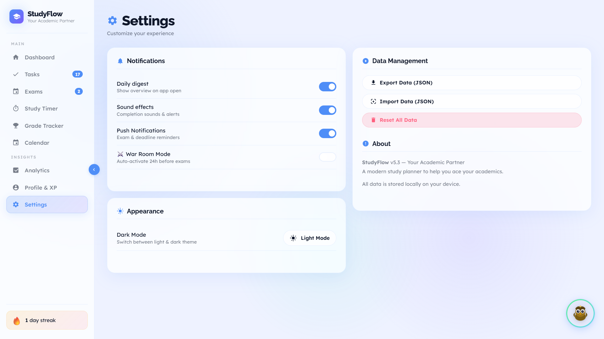

# 📘 StudyFlow — Smart Study Planner

**Version 5.3** · A modern, all-in-one academic productivity app built as a single HTML file.

> All data is stored locally in your browser via `localStorage`. No server, no sign-up, no tracking.

---

## ✨ Features

### 📊 Dashboard
- Welcome banner with live clock and personalised greeting
- Stat cards: Tasks completed, Study hours, Upcoming exams, Current GPA
- Motivational quote system with refresh — 250+ quotes
- Quick-view of pinned tasks and upcoming exams
- **Recent Study Sessions card** — shows the last 5 sessions (newest-first); hidden automatically when no sessions have been logged today so the Dashboard stays clean on fresh mornings
- Floating virtual pet companion that evolves with your XP level



### ✅ Tasks & Eisenhower Matrix
- Add, edit, pin, and delete tasks with category labels
- **Recurring tasks** — Daily, Weekdays, Weekly, Biweekly, or Monthly schedules with auto-generated occurrences
  - Future occurrences are **gated**: the next occurrence only appears on the Task Board after the previous one is completed; undoing a completion immediately re-hides the next occurrence
  - All occurrences remain visible in Calendar views regardless of gating
- **Task durations** — optional start and end times; Start Time auto-rounds to the next 15-minute boundary when the Add Task modal opens
- **Eisenhower Matrix** — tasks organised into 4 quadrants:
  - 🚨 **Do First** (Urgent + Important)
  - 📅 **Schedule** (Important, Not Urgent)
  - 📤 **Delegate** (Urgent, Not Important)
  - 🗑️ **Eliminate** (Not Urgent, Not Important)
- Full **drag-and-drop** between all quadrants and within quadrants
- Filter by status (All / Today / Yesterday / Last 7 Days) and category
- Due date tracking with overdue alerts
- Custom category management with colour coding



### 📅 Exams
- Add exams with subject, date, time, priority, target grade, and weight %
- Live countdown timers (Days → Hours → Minutes → Seconds) per card
- Urgency badges (Critical / Soon / Comfortable / Past)
- Colour-coded exam cards
- **⚔️ War Room Mode** — full-screen single-focus overlay auto-activates when an exam is within 24 hours (opt-in, off by default)



### ⏱️ Study Timer (Pomodoro)
- Configurable focus / short break / long break durations
- Visual ring progress indicator with animated countdown
- Session tracking with automatic break cycling
- **Focus Mode** — full-screen distraction-free overlay; notifications suppressed while active
- Sound notifications on session completion
- Session title persists across page refreshes
- **Expandable session history** — Today's Sessions card shows the last 3 sessions from today as a preview; a **Show All / Show Less** button with an animated chevron expands the full session history (all time, newest-first) with a "Today" badge on today's entries; panel resets to collapsed on page navigation



### 🏆 Grade Tracker

A single section with two tools selectable via tabs at the top of the page:

#### GPA Tracker tab
- Add assessments with module, name, score (%), and weight
- **Exact interpolated GPA** — `scoreToGPA()` linearly interpolates within each band, so 52.5% returns ~2.85 instead of a flat 2.70
- **Weighted GPA** calculated using credit-based formula
- Per-semester and per-subject filtering
- Stats: Weighted GPA, Semester average, Module count, Best score
- Grade distribution line chart (Chart.js)



#### Mark Tracker tab
- Add marks via a proper modal: subject, assessment name, scored/total, date, notes
- **Live percentage preview** updates as you type — shows % and grade letter before saving
- **Independent subject list** — separate from GPA Tracker subjects, designed for school students and non-university use
- Marks grouped by subject with a per-subject average bar
- Stats: Overall average, Highest %, Lowest %, Entry count
- Grade letters: A+ (≥85%) through F (<40%)



### 📆 Calendar
- **Month view** — cells and day-detail panel use consistent event data (tasks shown by due date)
- **Week view** — 7-column hour-by-hour grid; colour-coded chips for exams, tasks, and sessions
- **Day view** — 24-row timeline; auto-scrolls to current hour; recurring tasks marked with 🔁
- Tasks completable directly from the calendar day-detail panel
- All recurring task occurrences always visible in all views regardless of Task Board gating



### 📈 Analytics
- Study time chart (weekly bar chart, Chart.js)
- Task completion and category breakdown statistics
- **Heatmap with outcome correlation** — 28-day activity heatmap with coloured borders near recorded grade entries; insight card shows study-vs-performance correlation
- Charts are **destroyed and recreated** on every navigation (300 ms animation, no flicker)



### 🐾 Floating Pet Companion
- Persistent widget anchored to the bottom-right corner of every page
- **Idle float animation** — the widget gently bobs up and down on a 3-second cycle; pauses on hover
- **Gradient-border ring** — transparent interior with a true CSS gradient border (`background-clip: border-box`); hue shifts from blue toward teal-green as the pet levels up
- **Pulsing glow** — the ring emits a soft expanding-halo pulse in sync with the float animation
- **Level pip** — `Lv.X` badge appears in the top-left corner of the widget on hover
- **Reaction animations** — spin-wobble + sparkle burst fires on task completion, session end, mark entry, and player level-up
- Click for a contextual speech bubble (task count, streak, pet stage, XP) and +1 XP
- Context-aware auto-message every 10 minutes

### 👤 Profile & XP System
- Customisable name, designation, degree, university, email
- Avatar upload with auto-resize (max 200px, JPEG 0.8)
- **Gamification**: flat **50 XP per level** (reduced from `level × 100`); completing ~3 tasks levels you up
- Pet evolves **every player level** (previously every 2 levels):

  | Player level | Pet stage |
  |---|---|
  | 1 | Lv.1 Hatchling |
  | 2 | Lv.2 Chick |
  | 3 | Lv.3 Fledgling |
  | 4 | Lv.4 Juvenile |
  | 5 | Lv.5 Adolescent |
  | 6+ | … up to Lv.10 Legendary ✨ MAX |

- `renderPet()` shows `"evolves at player Lv.X"` so you always know how close the next evolution is
- Level progression (1–100) with evolving study pets
- Pet choices: 🦉 Owl, 🦊 Fox, 🐉 Dragon, 🤖 Robot
- Badge system — 15+ milestone badges



### 🔔 Push Notifications
- **Stacked banners** in a `#notif-stack` column at the top-right (up to 4 visible simultaneously; oldest auto-dismissed when limit is hit)
- Each banner has a **✕ close button**, a **colour-coded left accent border**, and a **progress bar** that drains over 5 seconds
- Smooth slide-in / collapse-out animations
- Native browser notifications (opt-in) as a background fallback
- Suppressed automatically during Focus Mode
- Toggling off immediately clears all pending notification timers

**Triggers:**

| Event | When | Accent |
|---|---|---|
| Exam — 7 days before | 7 days before exam | Orange |
| Exam — 24 hours before | 24 h before exam | Red |
| Exam — 1 hour before | 1 h before exam | Red |
| Task due — 1 hour before | 1 h before `dueDate` | Orange |
| Task due — 30 minutes before | 30 min before `dueDate` | Red |
| Daily study reminder | 9 AM if no session logged yet today | Teal |

### ⚙️ Settings
- **2-column layout**: Notifications + Appearance on the left; Data Management + About on the right
- Dark / Light theme toggle (Appearance card)
- Daily digest notification toggle
- Sound effects toggle
- Push Notifications toggle (opt-in)
- ⚔️ War Room Mode toggle (opt-in, off by default)
- Timer duration customisation
- **Data export** (JSON backup)
- **Data import** (restore from backup)
- Full data reset



---

## 🛠️ Tech Stack

| Layer | Technology |
|-------|------------|
| Structure | HTML5 (single file) |
| Styling | Vanilla CSS with CSS custom properties |
| Logic | Vanilla JavaScript (ES6+) |
| Charts | [Chart.js 4.4.1](https://cdn.chartjs.org/) (CDN) |
| Fonts | [Raleway](https://fonts.google.com/specimen/Raleway) + [Lexend](https://fonts.google.com/specimen/Lexend) (Google Fonts) |
| Storage | `localStorage` (browser-only) |
| Sound | Web Audio API (`AudioContext`) — singleton pattern |

**No build tools, no frameworks, no dependencies to install.**

---

## 🚀 Getting Started

### Option 1 — Live Demo
Open the app directly in your browser — no installation needed:
👉 [https://studyflow.gt.tc/](https://studyflow.gt.tc/)

### Option 2 — Run Locally
Clone the repo and open `index.html` directly in any modern browser:

```bash
git clone https://github.com/Dilhara-De-Alwis/StudyFlow.git
cd StudyFlow
```

Then double-click `index.html` in your file explorer — no server required.

---

## 📱 Responsive Design

Fully responsive across 4 breakpoints:

| Breakpoint | Target |
|------------|--------|
| > 1023px | Desktop — full sidebar |
| ≤ 1023px | Tablet — hamburger menu, collapsible sidebar with backdrop |
| ≤ 640px | Mobile — stacked layouts, full-width modals, compact stat cards |
| ≤ 380px | Small phone — single-column stats, tighter spacing |

Touch-friendly: action buttons always visible (no hover required), tap targets ≥ 48×48px, filter tabs horizontally scrollable.

---

## 💾 Data & Privacy

- **100% client-side** — all data stays in your browser's `localStorage`
- No server calls, no cookies, no analytics, no sign-up required
- Export your data anytime as a JSON file
- Import backups to restore data
- Avatar images compressed to ≤ 40 KB before storage to avoid `QuotaExceededError`

---

## 📂 Project Structure

```
StudyFlow/
├── index.html                            ← Main application (single-file SPA)
├── README.md                             ← Original readme
├── readme_2.md                           ← This file (with screenshots)
├── screenshots/                          ← App screenshots
│   ├── dashboard.png
│   ├── tasks.png
│   ├── exams.png
│   ├── timer.png
│   ├── marks_grades.png
│   ├── gpa_grades.png
│   ├── calendar.png
│   ├── analytics.png
│   ├── profile.png
│   └── settings.png
├── FULL_CHANGELOG.md                     ← Full version history (v1.0 → v5.3)
├── Enhanced Prompt of Version 1.0.txt    ← Refined AI build prompt for v1.0
├── Written Prompt of Version 1.0.txt     ← Original feature spec for v1.0
├── Written Prompt of Version 2.0.txt     ← Feature spec and bug list for v2.0
├── Written Prompt of Version 3.0.txt     ← Feature spec and bug list for v3.0
└── Written Prompt of Version 4.1.txt     ← Feature spec and bug list for v4.1
└── Written Prompt of Version 5.1.txt     ← Feature spec and bug list for v5.1
└── Written Prompt of Version 5.2.txt     ← Feature spec and bug list for v5.2
└── Written Prompt of Version 5.3.txt     ← Feature spec and bug list for v5.3
```

---

## 🗂️ Version History (Summary)

| Version | Codename | Highlights |
|---------|----------|------------|
| **v5.3** | Living System | Rebuilt notifications (stacked banners, 7 triggers, progress bar); floating pet overhaul (float animation, gradient-border ring, pulsing glow, level pip, hue shift); recurring task gating; interpolated GPA; Mark Tracker modal fix; flat 50 XP/level; expandable session history |
| **v5.2** | Clean Slate | Dark mode → Settings; Grade + Mark Tracker unified with tabs; Add Mark modal; Pet ring + reactions; removed login/leaderboard |
| **v5.1** | War Room | Recurring tasks; push notifications; floating pet; War Room mode; heatmap correlation; calendar weekly/daily views; 250 quotes; 10 bug fixes |
| **v4.3** | Solid Ground | Drag-and-drop rewrite; mobile overhaul; weighted GPA fix; 8 bug fixes |
| **v4.1** | Every Detail Matters | Eisenhower Matrix merged into Tasks; subject system; smart exam countdowns; 15 bug fixes |
| **v3.0** | Full Stack Student | GPA Tracker; JSON import; PDF export; Focus Mode; adaptive XP; pinned tasks; calendar |
| **v2.0** | Academic Partner | Analytics page; badge system; dark mode; avatar upload |
| **v1.0** | Initial Release | Tasks, Exams, Timer, Dashboard, Profile, Gamification |

Full details in [`FULL_CHANGELOG.md`](./FULL_CHANGELOG.md).

---

## 🎨 Design

- **Glassmorphism** — frosted glass cards with `backdrop-filter: blur`
- **Aurora background** — animated gradient blobs (3 layers)
- **Dark mode** — full dark theme with smooth CSS variable transitions
- **Micro-animations** — page transitions, hover effects, XP floats, confetti on achievements, pet sparkle bursts, idle float animation on floating pet, pulsing ring glow
- **Typography** — Raleway (headings, 400–900) + Lexend (body, 300–600)

---

## 📄 License

This project is created for academic purposes as part of a university assignment.
